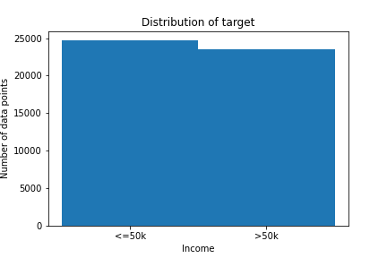

# Assignment: us-income
### Description
This is an assignment we got during our time at Becode.  
The main goal was to get acquainted with different model evalution techniques.  
For this we got a dataset on the income of residents in the USA.  
This dataset had already been preprocessed, and split for us into  
train and test.
### Goal
- Be able to analyze a machine learning problem
- Be able to reason about possible causes of overfitting
- Be able to remedy the causes of overfitting
- Be able to tune parameters of a machine learning model
- Be able to write clean and documented code.

# Installation
### Python version
- Python 3.9

### Packages used
* pandas
* numpy
* seaborn
* matplotlib
* sklearn

# Usage

| File         | Description                                                                     |
|--------------|---------------------------------------------------------------------------------|
| main.ipynb   | Jupyter Notebook, containing Python code.   I used this to train a model as good as possible, using RandomForestClassifier. |
| functions.py | File containing Python code.   In here I put all the functions I used in main.py |
| CSV          | Folder containing .csv files.   Holds data on US-income.    We were given for this assignment. |
| Visuals      | Folder containing .png files. Holds images I used to base my findings on, and draw my conclusions. |

# Findings
### 1. Creating baseline model using RandomForestClassifier

| Metric                            | Score  |
|-----------------------------------|--------|
| Score on training set             | 0.999  |
| Score on testing set              | 0.852  |
| cross_validation_score - Accuracy | 85.80% |
| Matthews correlation coefficient  | 0.571  |

We can clearly see that the model is overfitting when comparing to cross_validation_score.  
The model does a really bad job at predicting "1".

### 2. Modeling with normalized data.

| Metric                            | Score  |
|-----------------------------------|--------|
| Score on training set             | 0.801  |
| Score on testing set              | 0.796  |
| cross_validation_score - Accuracy | 79,45% |
| Matthews correlation coefficient  | 0.320  |

The score has dropped in every way.   
Looking at the confusion matrix, we notice that it has gotten slightly better at predicting "0",  
but has gotten even worse at predicting "1".

### 3. Looking for better parameters, using RandomizedSearchCV
| Metric                            | Score  |
|-----------------------------------|--------|
| Score on training set             | 0.999  |
| Score on testing set              | 0.854  |
| cross_validation_score - Accuracy | 85.83% |
| Matthews correlation coefficient  | 0.578  |

The scores have gotten slightly better after improving some parameters. The model is still overfitting though, and the improvement on predicting "1" is small.

### 4. Combined two datasets into one, splitting them up using train_test_split from sklearn.
Before train_test_split I now have a DataFrame of shape: (48842, 15)

| Metric                            | Score  |
|-----------------------------------|--------|
| Score on training set             | 0.999  |
| Score on testing set              | 0.858  |
| cross_validation_score - Accuracy | 85.68% |
| Matthews correlation coefficient  | 0.592  |

No noticeable improvements, but hasn't gotten noticeably worse either.

### 5. Modeling a balanced dataset.
What I'm noticing is that the model is always having problems predicting "1".   
The dataset is also very unbalanced, meaning a lot more datapoints with target "0".  
This shows the distribution on the data, containing 48842 rows:

By copying the rows that have as target "1", I can obtain a much more balanced dataset.  
The result is I now have a dataset with 72216 rows, but almost evenly distributed:

| Metric                            | Score  |
|-----------------------------------|--------|
| Score on training set             | 0.999  |
| Score on testing set              | 0.933  |
| cross_validation_score - Accuracy | 91.58% |
| Matthews correlation coefficient  | 0.872  |

Balancing the dataset out, helped a lot!  
All scores increased by a significant amount.  
This also finally improved the predicting of target "1".

# Contributors
| Name          | Github                           |
|---------------|----------------------------------|
| Matthew Samyn | https://github.com/matthew-samyn |

# Timeline
13/08/2021 - 16/08/2021